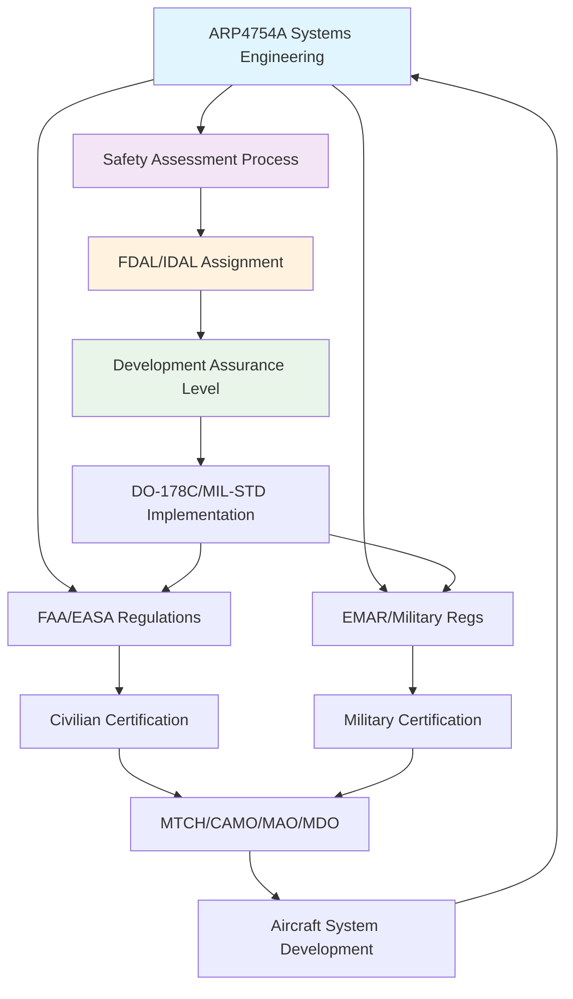
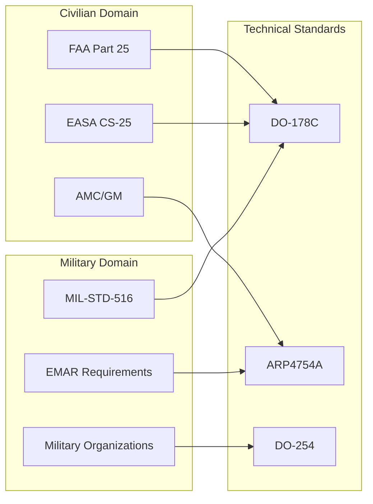
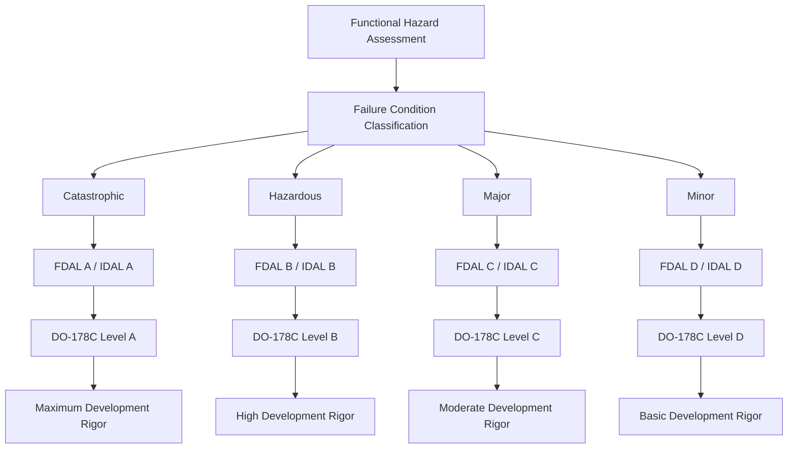

# GEOT

```mermaid
  graph TD
      A[ARP4754A Systems Engineering] --> B[Safety Assessment Process]
      B --> C[FDAL/IDAL Assignment]
      C --> D[Development Assurance Level]
      D --> E[DO-178C/MIL-STD Implementation]
      
      F[FAA/EASA Regulations] --> G[Civilian Certification]
      H[EMAR/Military Regs] --> I[Military Certification]
      
      G --> J[MTCH/CAMO/MAO/MDO]
      I --> J
      
      A --> F
      A --> H
      E --> F
      E --> H
      
      K[Aircraft System Development] --> A
      J --> K
      
      style A fill:#e1f5fe
      style B fill:#f3e5f5
      style C fill:#fff3e0
      style D fill:#e8f5e8
```

```mermaid
graph LR
    subgraph "Civilian Domain"
        A1[FAA Part 25]
        A2[EASA CS-25]
        A3[AMC/GM]
    end
    
    subgraph "Military Domain"
        B1[EMAR Requirements]
        B2[MIL-STD-516]
        B3[Military Organizations]
    end
    
    subgraph "Technical Standards"
        C1[DO-178C]
        C2[ARP4754A]
        C3[DO-254]
    end
    
    A1 --> C1
    A2 --> C1
    A3 --> C2
    B1 --> C2
    B2 --> C1
    B3 --> C3
```

```mermaid
flowchart TD
    A[Functional Hazard Assessment] --> B[Failure Condition Classification]
    B --> C[Catastrophic]
    B --> D[Hazardous]
    B --> E[Major]
    B --> F[Minor]
    
    C --> G[FDAL A / IDAL A]
    D --> H[FDAL B / IDAL B]
    E --> I[FDAL C / IDAL C]
    F --> J[FDAL D / IDAL D]
    
    G --> K[DO-178C Level A]
    H --> L[DO-178C Level B]
    I --> M[DO-178C Level C]
    J --> N[DO-178C Level D]
    
    K --> O[Maximum Development Rigor]
    L --> P[High Development Rigor]
    M --> Q[Moderate Development Rigor]
    N --> R[Basic Development Rigor]
```
    
    C1 --> D[Certified Aircraft System]
    C2 --> D
    C3 --> D
